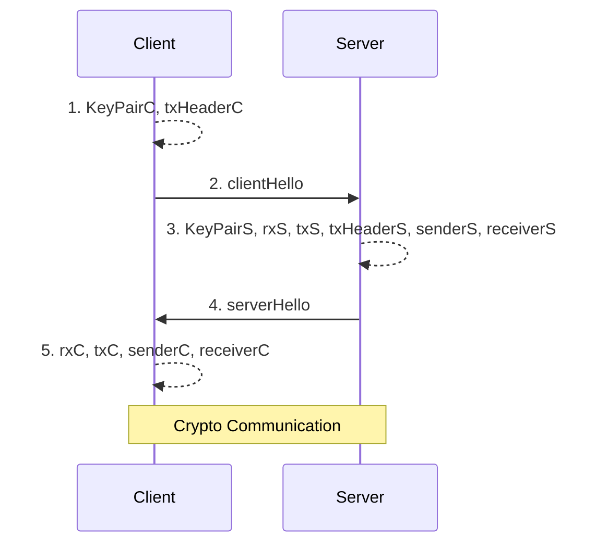
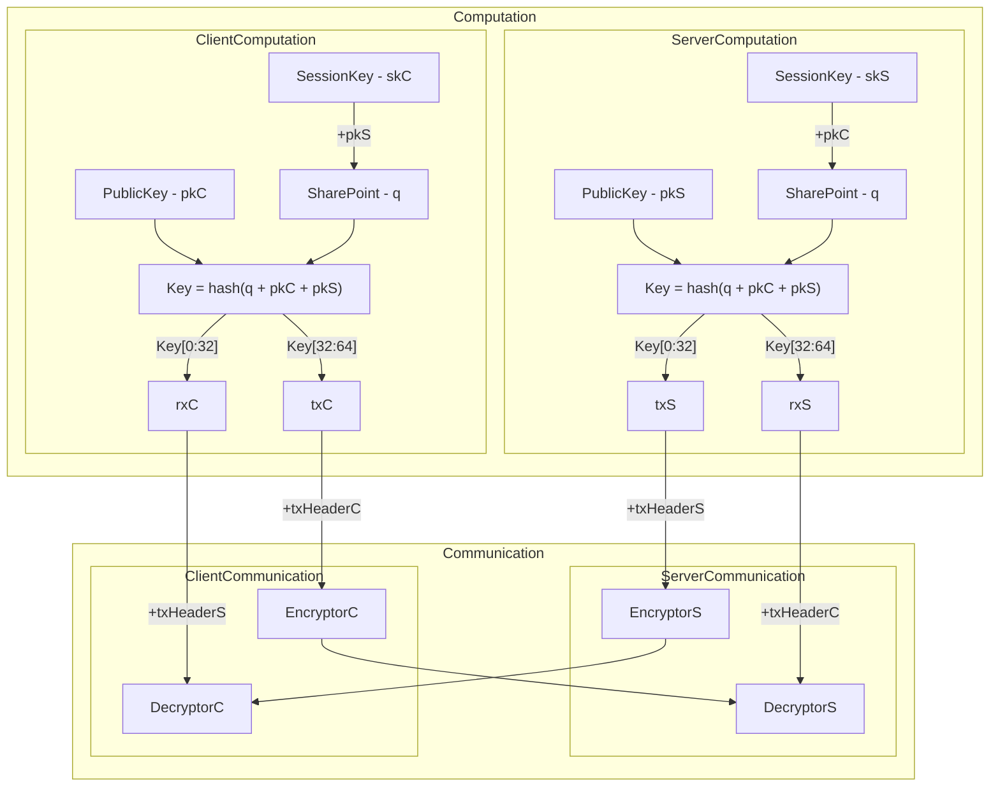

# Ziti's Model Simulation

## Sequence Diagram

## Crypto Model - Base Curve25519

### Prep: Exchange Public Key and txHeader

### Crypto

+ Keypoint:
  1. The two SharePoints, q, in both ServerComputation and ClientComputation are the same.
  2. Since q is the same, it fllows that the Keys in both side, which are derived from hash q + pkC + pkS, are also the same.
  3. And also, txS(Key[0:32]) is same as rxC(Key[0:32]). They will plus txHeaderS to make cryptor. So, DecryptorC can decrypt the cipher from EncryptorS.
  4. By the same reasoning, DecryptorS can decrypt the cipher from EncryptorC.
