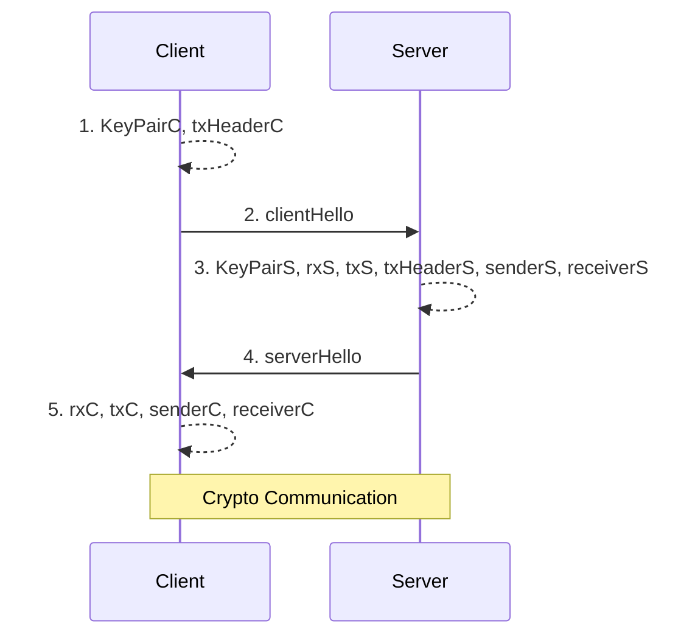

# Ziti's Model Simulation

## Sequence Diagram

```mermaid
sequenceDiagram
    participant c as Client
    participant s as Server

    c -->> c: 1. KeyPairC, txHeaderC
    c ->> s: 2. clientHello
    s -->> s: 3. KeyPairS, rxS, txS, txHeaderS, senderS, receiverS
    s ->> c: 4. serverHello
    c -->> c: 5. rxC, txC, senderC, receiverC
    Note over c, s: Crypto Communication
```

## Crypto Model
