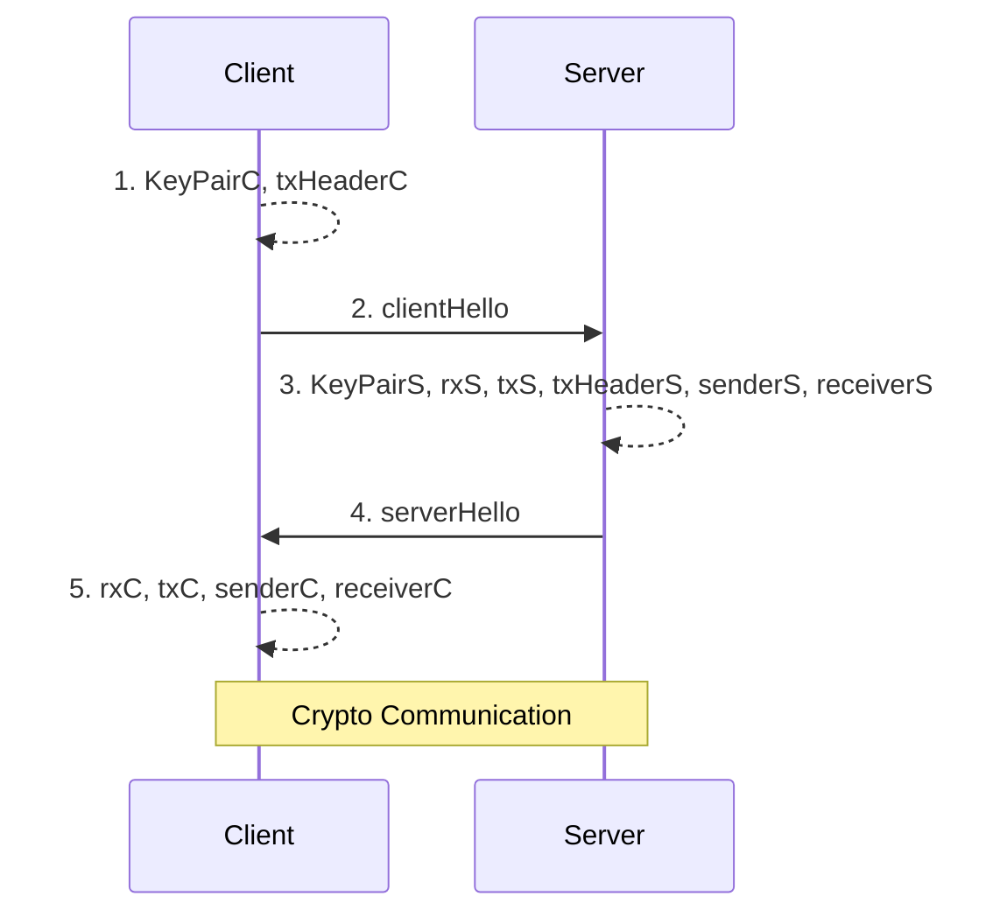
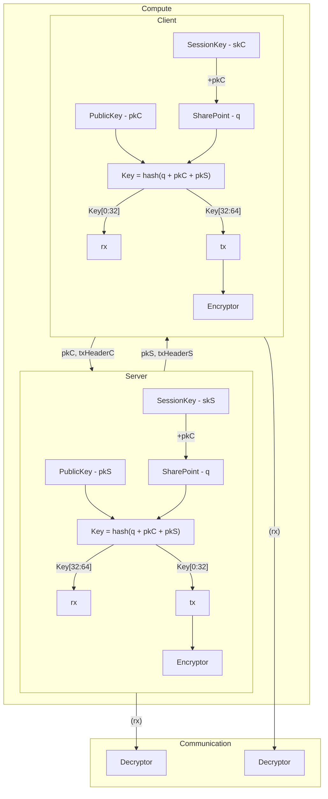

# Ziti's Model Simulation

## Sequence Diagram

```mermaid
sequenceDiagram
    participant c as Client
    participant s as Server

    c -->> c: 1. KeyPairC, txHeaderC
    c ->> s: 2. clientHello
    s -->> s: 3. KeyPairS, rxS, txS, txHeaderS, senderS, receiverS
    s ->> c: 4. serverHello
    c -->> c: 5. rxC, txC, senderC, receiverC
    Note over c, s: Crypto Communication
```

## Crypto Model - Base Curve25519

```mermaid
graph TB
    subgraph Compute
        direction LR

        subgraph Server
            direction TB
            SA[SessionKey - skS] -->|+pkC| SC[SharePoint - q]
            SB[PublicKey - pkS] --> SD["Key = hash(q + pkC + pkS)"]
            SC --> SD
            SD -->|"Key[32:64]"| SE[rx]
            SD -->|"Key[0:32]"| SF[tx]
            SF --> SH[Encryptor]
        end

        subgraph Client
            direction TB
            CA[SessionKey - skC] -->|+pkC| CC[SharePoint - q]
            CB[PublicKey - pkC] --> CD["Key = hash(q + pkC + pkS)"]
            CC --> CD
            CD -->|"Key[0:32]"| CE[rx]
            CD -->|"Key[32:64]"| CF[tx]
            CF --> CH[Encryptor]
        end

        Server -->|pkS, txHeaderS| Client
        Client -->|pkC, txHeaderC| Server
    end

    subgraph Communication
        direction TB
        Server --> |"(rx)"| SG[Decryptor]
        Client --> |"(rx)"| CG[Decryptor]
    end
```
