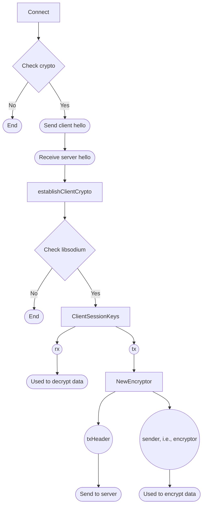

# TLS in Ziti

The model seems like TLS 1.3 with using DH, but without certificate.

It seems like only focus on key exchange and cryption without authentication.

---

## Flow Chart

## [Handshake](handshake.md)

### Connect

1. In connect function, we first check if it needs "crypto" and extract its(local) public key.
2. And, we send the first "hello" message including public key and some configs to peer endpoint.
3. Then we get the crypto method from the reply message, including TLS version and encrypt alogorithm.
4. Also, we get the peer side public key from reply message.
5. Then, it's time to estblish client crypto, i.e., call the "[establishClientCrypto](#establishclientcrypto)" function.

### establishClientCrypto

1. Check if it is based on "libsodium"; otherwise, break it.
2. Use local key and peer key and the "[ClientSessionKeys](#clientsessionkeys)" function to make the session key: rx(decrypt received data), tx(encrypt sent data).
3. Create an "encryptor" as "conn.sender" which is used to encrypt and send data.
4. Then, we need to send "txHeader" to peer side for secretstream initialization.
5. Finally, we will use this sender to send data and use rx to decrypt message.

### ClientSessionKeys

1. At first, we use curve25519 to compute a share secret key.
2. Use blake2b to initialize a hash function.
3. Then, write the share secret key, client's and server's public key to this hash function.
4. In the end, we can calculate the rx and tx via the hash function with three keys.

## [Encrypt](encrypt.md)

### Write

1. Check if connection is under crypto.
2. If it is crypted, push data into the conn.sender(an ecryptor) and write the cipher text into message channel; otherwise, write data into the message channel directly.

---

## Reference

[Openziti: sdk-golang](https://github.com/openziti/sdk-golang)

[Openziti: secretstream](https://github.com/openziti/secretstream)

[ChatGPT](https://openai.com/chatgpt/)
